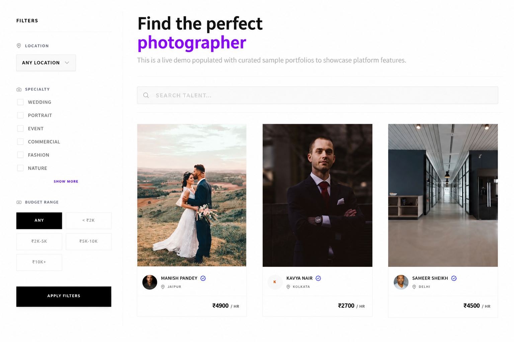
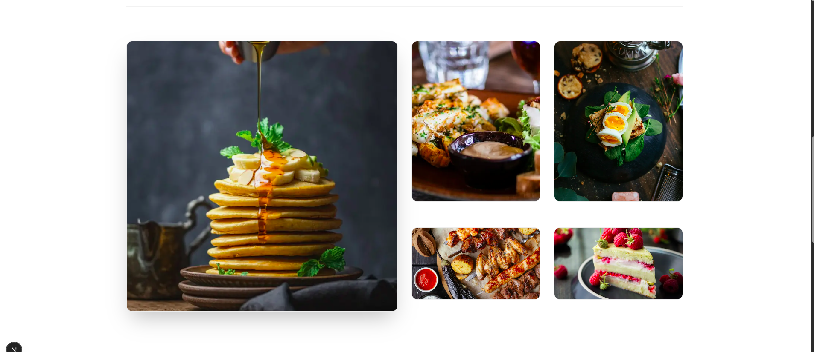
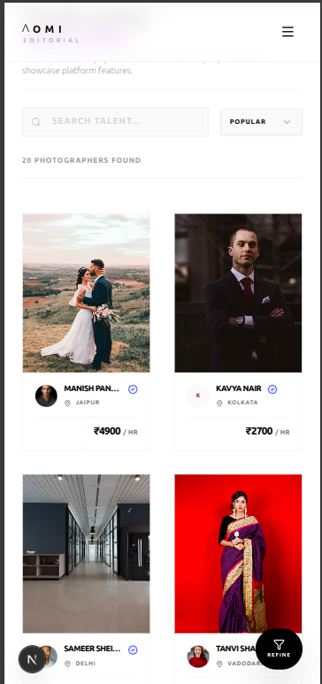
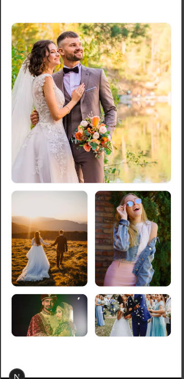

# ΛOMI Editorial

<p align="center">
  <strong>A full-stack marketplace connecting editorial photographers with clients</strong>
</p>

<p align="center">
  
  
  
  
  
  
</p>

<p align="center">
  <a href="https://aomi.space" target="_blank"><strong>🌐 Visit Deployed Studio: aomi.space &rarr;</strong></a>
</p>

---

## Table of Contents

- [Overview](#overview)
- [Screenshots](#screenshots)
- [System Architecture](#system-architecture)
- [Engineering Decisions](#engineering-decisions)
- [Project Structure](#project-structure)
- [Tech Stack](#tech-stack)
- [API Documentation](#api-documentation)
- [E2E Testing Suite](#e2e-testing-suite)
- [Getting Started](#getting-started)
- [Commands](#commands)
- [Let's Connect](#lets-connect)

---

## Overview

> [!TIP]
> **🚀 Experience the Platform Live:**
> Explore the live production build immediately at **[aomi.space](https://aomi.space)**. 
> The database is fully populated with 20 sample Indian photographers, demonstrating search, location filters, custom bento portfolio grids, and dashboard views.

**ΛOMI Editorial** connects professional editorial photographers with potential clients. Photographers get a shareable, responsive public profile that acts as their personal website, and a studio dashboard to customize their portfolio layouts using a bento grid editor.

### Key Features

*   **Bento Portfolio Builder:** Drag-and-drop layout configuration for live portfolios.
*   **Discovery Feed:** Multi-criteria location, specialty, and price filtering to connect clients with talent.
*   **CDN-Optimized Media:** Cloudinary integration for compressed, responsive image delivery.
*   **Decoupled State Management:** TanStack Query for server-state caching paired with Zustand for local UI states.
*   **Visual Loading Skeletons:** React Suspense to handle asynchronous component loading states.
*   **Dual-Token Authentication:** Stateless JWT session management with custom CSRF protection.
*   **Feature-Sliced Structure:** Domain-driven frontend architecture to keep queries, views, and components modular.
*   **E2E Testing Suite:** Frontend workflow coverage powered by Playwright.

---

## Screenshots

### Discover Feed & Bento Portfolios

<div align="center" style="max-width: 800px; margin: 0 auto;">
  <!-- Desktop Screenshots: Each on their own row to prevent squishing -->
  
  <br/>
  
  <br/>
  <!-- Mobile Screenshots: Side-by-side in the same row -->
  
  
</div>
---

## System Architecture

The platform's high-level architecture separates the client-side code from the backend API endpoints:

```txt
Next.js Client (Port 3000)
      │
      ▼  [HTTP API Requests]
Express Server (Port 3001)
      │
      ├─► [Database Storage]  ──► MongoDB (Mongoose ODM)
      └─► [Media Processing]  ──► Cloudinary CDN
```

A full system deep-dive detailing client caching, Next.js page guards, and how the middleware layers run is fully documented in **[docs/system_architecture.md](docs/system_architecture.md)**.

*   **Frontend Client:** Next.js 15 App Router running server-components-first layouts.
*   **Express API Server:** Node.js backend executing security, rate-limiting, and validation middleware.
*   **Database & CDN:** Document storage via MongoDB and media transformations via Cloudinary.

---

## Engineering Decisions & Learning Journey
*   **Learning Authentication & Security:** I followed modern backend security standards to protect users. I integrated **Helmet** for secure HTTP headers, implemented **CSRF protection**, and stored session JWTs inside secure **HttpOnly cookies**. 
*   **State Management (Zustand & React Query):** I chose **Zustand** simply because it is extremely easy to use, lightweight, and didn't require complex Redux boilerplate for local UI settings. I paired it with **React Query** to automatically handle fast caching, automatic background data refetching, and pagination for photographer discovery feeds.
*   **Separate Directories:** I kept the frontend and backend code in completely separate directories so I could build, deploy, and scale them independently on Vercel.

---

## Project Structure

```
├── backend/                  # Express.js REST API
│   └── src/
│       ├── app.ts            # Entry point (Express, route mounts, security headers, rate limits)
│       ├── config.ts         # Environment variable schemas & configuration loader
│       ├── db/               # MongoDB / Mongoose connection setup & mock data seeder
│       ├── constants/        # System-wide type-safe constants (booking, uploads, errors)
│       ├── controllers/      # Route handlers (delegates business tasks to services)
│       ├── services/         # Business Logic Layer (Auth, User, Cloudinary, Resend Email)
│       ├── models/           # Mongoose schemas and model definitions
│       ├── routes/           # REST API routes
│       ├── middlewares/      # Express middlewares (auth, errorHandler, rate-limiter, csrf)
│       ├── validations/      # Zod validation schemas for payload validation
│       └── utils/            # Grouped core utilities
│
└── frontend/                 # Next.js 15 Client App
    ├── e2e/                  # Playwright E2E browser tests
    └── src/
        ├── app/              # App Router directory (page routes, server components, main layouts)
        ├── components/       # Globally shared UI components
        ├── features/         # Feature-sliced modular layout (capsules business domains)
        │   ├── auth/         # Context providers, query hooks, login/register views
        │   ├── discovery/    # Search filters, specialties selection, responsive discovery grid
        │   ├── landing/      # Clean, magazine-grade hero and CTA sections
        │   ├── onboarding/   # Multi-step studio onboarding layout for photographers
        │   ├── photographer-studio/ # Interactive dashboard & Bento portfolio builder
        │   ├── profile/      # User settings, name, avatar, and security fields
        │   └── public-profile/ # Shareable photographer profile layouts (Mini-Websites)
        ├── hooks/            # Shared custom React hooks
        └── lib/              # Shared client integrations (Axios client, React Query provider)
```

---

## Tech Stack

| Frontend (Client) | Backend (API) |
| :--- | :--- |
| **Next.js 15** (App Router, Server Components) | **Node.js & Express.js** (RESTful API Router) |
| **React 19** & TypeScript | **TypeScript** for end-to-end type safety |
| **Tailwind CSS v4** & shadcn/ui | **MongoDB** & Mongoose ODM |
| **TanStack Query v5** (Server-state caching) | **Stateless Auth** via HTTP-Only Cookies (JWT) |
| **Zustand v5** (Lightweight global UI states) | **Zod** schema validations |
| **React Hook Form** with Zod integrations | **Cloudinary** (Image CDN uploads) |
| **Playwright** (E2E browser tests) | **Resend** (transactional emails) |

---

## API Documentation

The complete backend REST API is versioned under `/api/v1/` and thoroughly documented in **[docs/api.md](docs/api.md)**. It outlines endpoints, Zod validation schemas, and expected request/response formats for:
*   **Authentication:** CSRF issuance, stateless session rotation, transactional email verifications.
*   **User Accounts:** User configurations, profile avatar uploads.
*   **Photographer Profiles:** Dashboard stats, pricing/specialty/location metadata updates.
*   **Portfolio Gallery:** Secure Cloudinary upload/deletions, Bento layout reordering grids.

---

## E2E Testing Suite

Automated user flows are validated via Playwright:
*   **Location:** `frontend/e2e/`
*   **Coverage:** User Authentication flows, registration validations, onboarding sheets, and bento-grid updates.
*   **Execution Commands:**
    *   `pnpm run test` — Runs E2E tests in a headless automated browser.
    *   `pnpm run test:ui` — Opens the Playwright interactive UI runner to view visual step-by-step executions.

---

## Getting Started

### Prerequisites
*   Node.js 18+ & MongoDB
*   Cloudinary & Resend API keys

### Setup & Run

1. **Clone the repository:**
   ```bash
   git clone <repository-url>
   cd Photophile
   ```

2. **Configure & Start Backend:**
   ```bash
   cd backend
   cp .env.example .env # Configure MongoDB, Cloudinary, and Resend credentials
   pnpm install
   pnpm run dev
   ```

3. **Configure & Start Frontend:**
   ```bash
   cd ../frontend
   cp .env.local.example .env.local # Update NEXT_PUBLIC_API_URL if needed
   pnpm install
   pnpm run dev
   ```

The frontend client will run at `http://localhost:3000` and the API at `http://localhost:3001`.

---

## Commands

All actions are executed using `pnpm` from their respective directories:

| Target | Task | Command |
| :--- | :--- | :--- |
| **Backend** | Start Dev Server | `pnpm run dev` |
| **Backend** | Seed 20 Photographers | `pnpm run seed` |
| **Backend** | Clear Database | `pnpm run clean` |
| **Backend** | Build Server | `pnpm run build` |
| **Frontend** | Start Client Dev | `pnpm run dev` |
| **Frontend** | Build Production | `pnpm run build` |
| **Frontend** | Run Playwright Tests | `pnpm run test` |

---

## Let's Connect

Thank you for exploring **ΛOMI Editorial**! Feel free to reach out to connect or discuss modern full-stack development.

*   **Portfolio**: [venkatnithin.space](https://venkatnithin.space)
